# PowerLauncher  

  - **What is it:** Quick launcher that has additional capabilities
    without sacrificing performance

  - **Author:** Jessica Yuwono

  - **Spec Status:** Review

# 1\. Overview

| **Terminology** | **Definition**                                                                              |
| --------------- | ------------------------------------------------------------------------------------------- |
| Context menu    | The menu which opens when a user performs right-click/Shift+F10 on a selected search result |
| Text suggestion | Text which appears on the search box when users type           |
| App suggestion  | List of applications that may be relevant on the search result based on the typed string    |

## 1.1. Elevator Pitch / Narrative

Jane is a Windows power user who uses Run prompt to launch her
applications. She types in the executable name for most cases. However,
sometimes she needs to search the name of the application she needs to
launch. Search is slower compared to Run prompt and she often doesn’t
get the result that she wants. She is frustrated at how slow it is to
launch an application from search and when she types too fast, it will
take her to web search which is not what she expects.

She learns about PowerToys and installed PowerToys on her machine. Once
Jane downloads it, PowerLauncher is included in PowerToys. She can now
search for an application and launch an application instantly with
PowerLauncher. She can also personalize her launcher to cater to her
needs by putting search based on executable names on top of the result
and show her the most recently used application. She can also add
plugins which gives her additional features like calculator or
dictionary which she needs. After using PowerLauncher, she feels more productive since it is fast, customizable, and it gets the result
that she wants.

### 1.1.1 Short Version

It’s fast… It’s customizable… It’s PowerLauncher, a new toy in PowerToys
that can help you search and launch your app instantly\! It is open
source and modular for additional plugins.

## 1.2. Customers

PowerToys is mainly targeted towards Windows power users though it is
available to users who want to experience using Windows in a more
efficient and productive way.

## 1.3. Problem Statement and Supporting Customer Insights

Through [GitHub
issues](https://github.com/microsoft/PowerToys/issues/44) in PowerToys
repository, Windows users expressed the need for a fast and reliable
launcher with additional capabilities, such as text suggestion as users
type, auto-completion on tab, and options to do more actions like run in
administrator mode or open in PowerShell. Windows users also pointed out
that search is not fast enough and it does not give results that are
relevant to them. This issue received the fourth most thumbs up (with
70+ thumbs up) in the category of suggested PowerToy indicating that
users are interested in this PowerToy.

### 1.3.1 Survey Results

PowerToys team sent a survey to Windows Developer community to gain preliminary insights on users’ current launch experience. Here are some key takeaways:

1.  Nearly 70% of respondents want “run as administrator” to be a
    feature in an application launcher. The next most requested feature
    is auto-complete text suggestions.

2.  Less than 15% of respondents who use Windows as their main OS use
    third-party tools as a part of their launch experience.

3.  Nearly 65% of respondents enters an application name when searching.

4.  All respondents who use MacOS as their main OS and use third-party tools to launch an
    application runs Alfred.

5.  For respondents who use Search on Windows, performance and accuracy
    of search result are two top most requested improvements that
    they would like to see.

## 1.4. Existing Solutions or Expectations

Currently, power users can launch an application using Windows launcher by
running Win+R shortcut or searching the desired application in Windows
Search (Win+S, Windows menu + start typing). Power users can also search
for results through Windows Search by typing in the search bar directly
or by specifying a category (apps, documents, email, web, folders,
music, people, photos, settings, and videos). Several third-party tools
also exist to extend the capability of Windows’ launcher.

Here is a matrix which compares features between third-party tools:

<table>
<thead>
<tr class="header">
<th>Tools/ 
Features</th>
<th>Text suggestion</th>
<th>App suggestion</th>
<th>Open in cmd/powershell (or terminal)</th>
<th>Run as admin</th>
<th>Saved history from previous session</th>
<th>Open file location</th>
</tr>
</thead>
<tbody>
<tr class="odd">
<td><a href="https://www.alfredapp.com/">Alfred</a> (free)</td>
<td></td>
<td></td>
<td></td>
<td></td>
<td></td>
<td></td>
</tr>
<tr class="even">
<td><a href="https://support.apple.com/en-us/HT204014">Spotlight</a></td>
<td></td>
<td></td>
<td></td>
<td></td>
<td></td>
<td></td>
</tr>
<tr class="odd">
<td><a href="https://www.listary.com/">Listary</a></td>
<td></td>
<td></td>
<td></td>
<td> shown as a separate cmd</td>
<td></td>
<td> on right click</td>
</tr>
<tr class="even">
<td><a href="http://www.wox.one/">Wox</a></td>
<td></td>
<td></td>
<td> via “&gt;” or Win+R</td>
<td> on right-click</td>
<td></td>
<td> on right click</td>
</tr>
<tr class="odd">
<td><a href="https://www.launchy.net/index.php">Launchy</a></td>
<td></td>
<td></td>
<td></td>
<td></td>
<td></td>
<td></td>
</tr>
<tr class="even">
<td><a href="https://github.com/davatorium/rofi">Rofi</a></td>
<td></td>
<td></td>
<td>N/A</td>
<td>N/A</td>
<td></td>
<td></td>
</tr>
<tr class="odd">
<td><a href="http://www.executor.dk/">Executor</a></td>
<td></td>
<td></td>
<td></td>
<td> Shift+enter</td>
<td></td>
<td> on right click</td>
</tr>
<tr class="even">
<td>Run (Win+R)</td>
<td></td>
<td></td>
<td></td>
<td> Ctrl+Shift+enter</td>
<td></td>
<td></td>
</tr>
<tr class="odd">
<td>Search (Win+S)</td>
<td></td>
<td></td>
<td></td>
<td> on right click</td>
<td></td>
<td>on right click</td>
</tr>
</tbody>
</table>

Here are some screenshots on Spotlight and some of the most commonly used third-party
launchers:

1.  Spotlight

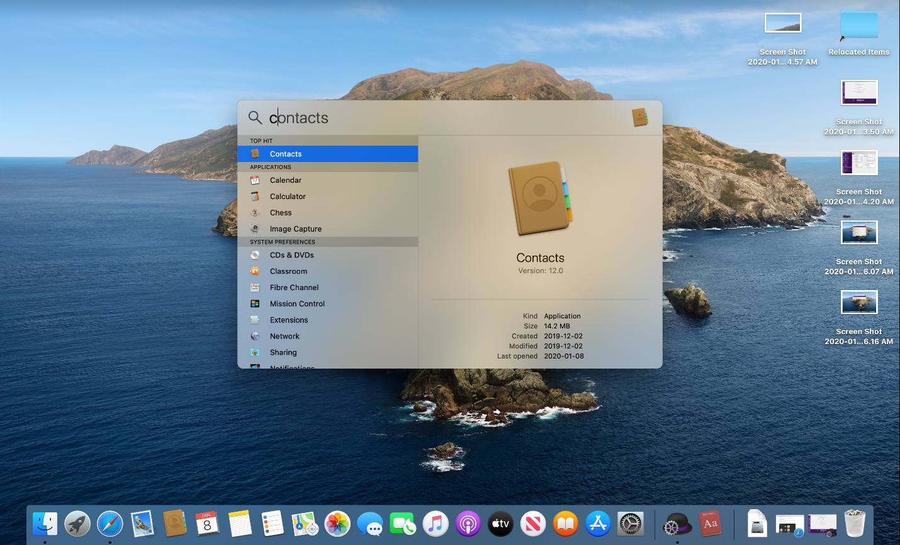

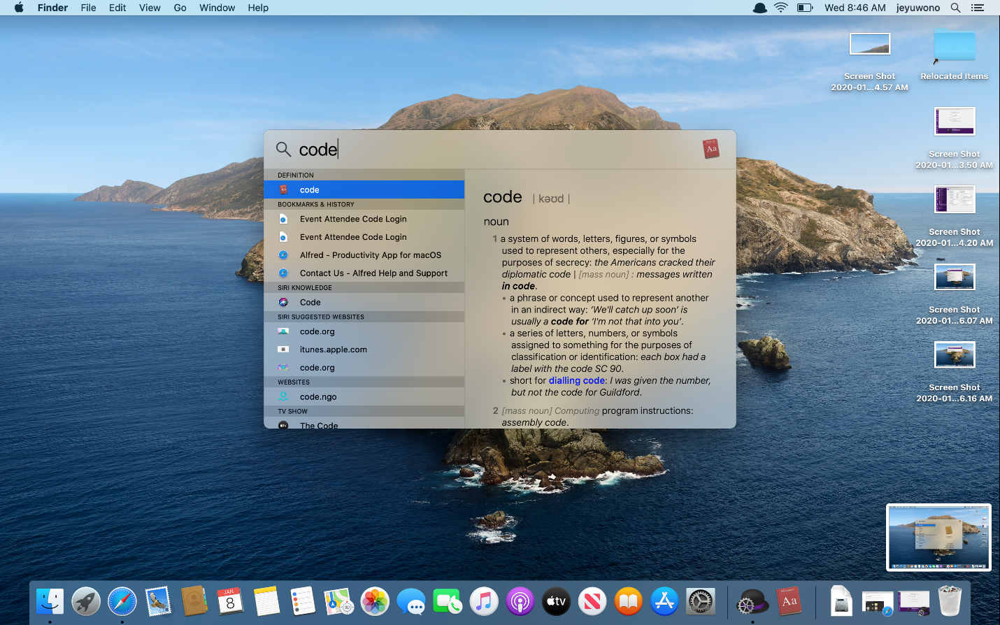

2.  Wox

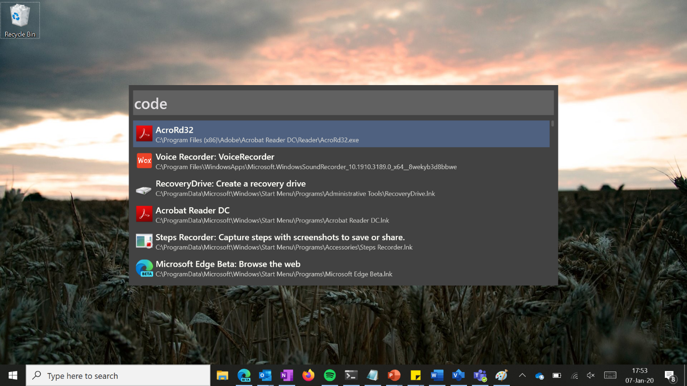

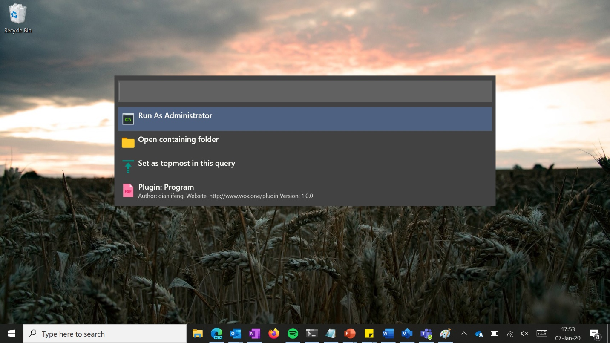

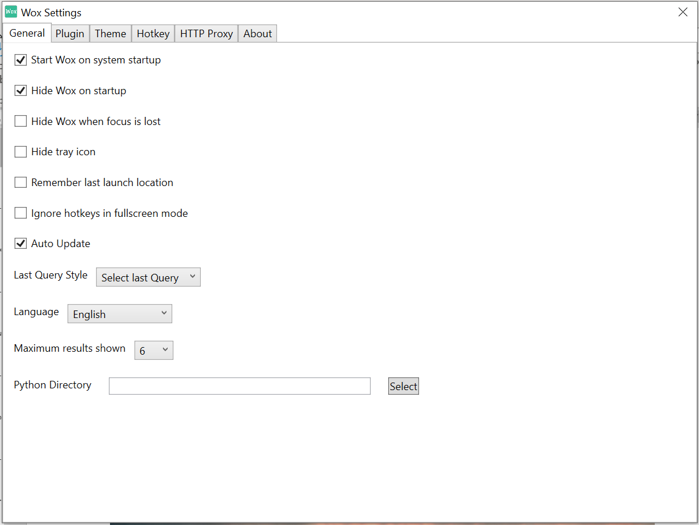

3.  Launchy

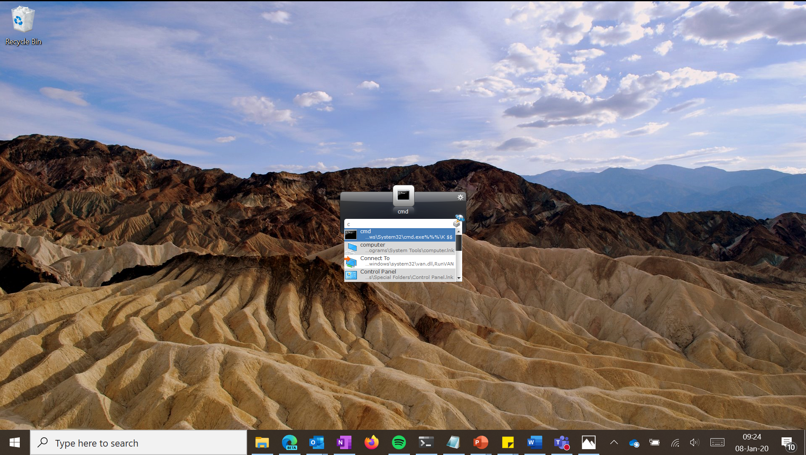

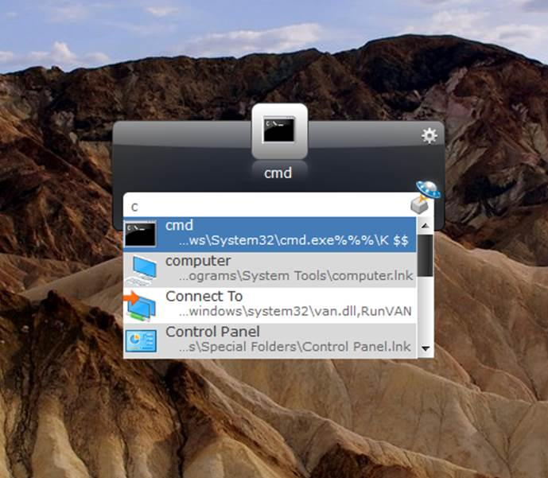

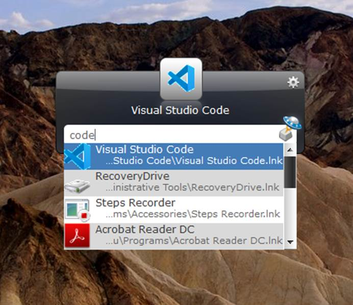

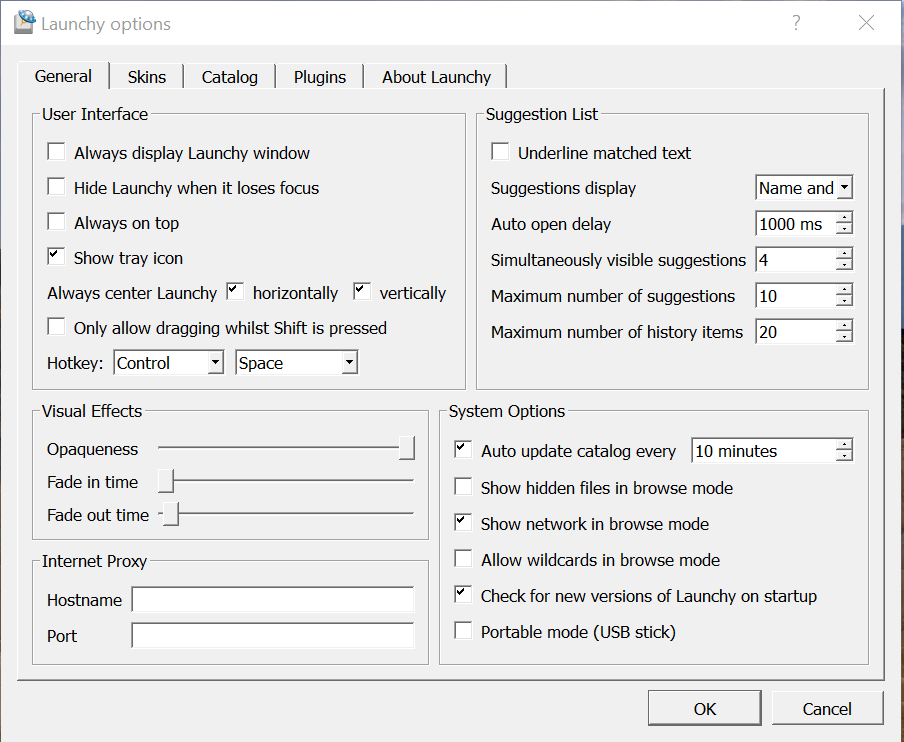

4.  Alfred

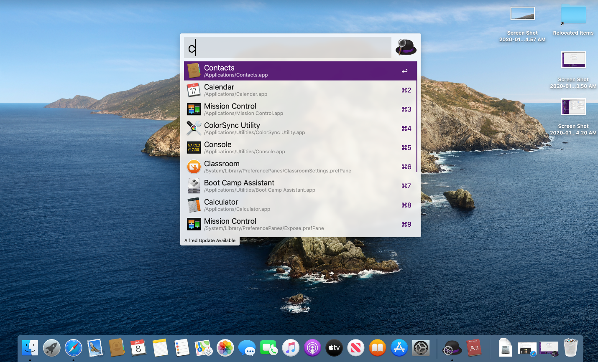

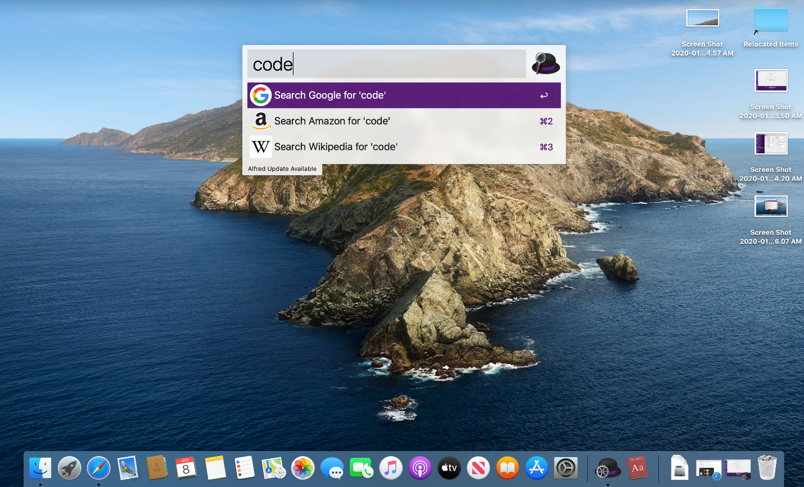

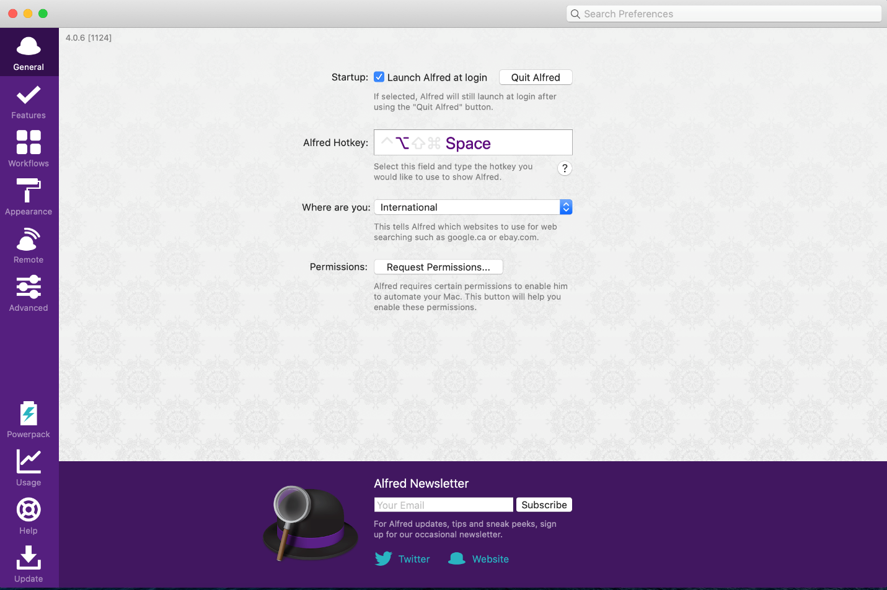

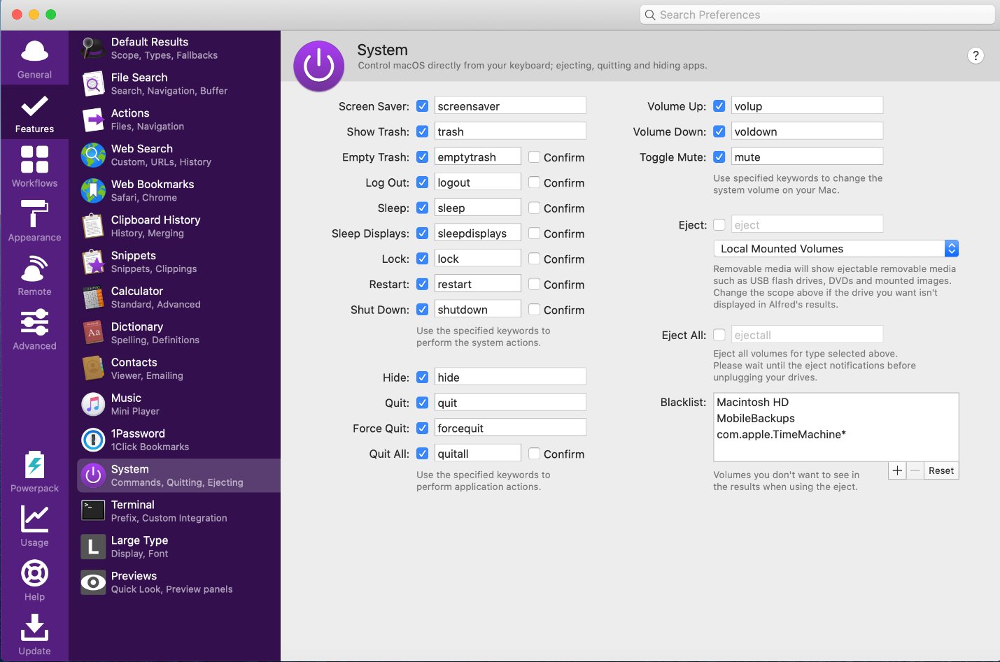

## 1.5. Goals/Non-Goals

### 1.5.1 Goals

**a. User Experience**

  - > PowerLauncher is a fast launcher with additional capabilities that
    > users need

  - > PowerLauncher is available for Windows 10

  - > PowerLauncher should be faster than start menu/Win+S for showing
    > the search result and launching applications

**b. Settings**

  - > PowerLauncher UI for settings should be integrated with other
    > PowerToys settings

**c. Keyboard Shortcut**

  - > PowerLauncher default keyboard shortcuts should not conflict with
    > other PowerToys’ keyboard shortcuts

  - > PowerLauncher’s default keyboard shortcuts are customizable by
    > users

### 1.5.2 Non-Goals

**a. User Experience**

  - > Support Windows version earlier than Windows build 17134

**b. Settings**

  - > Only disabling PowerLauncher telemetry. Users will be able to turn off
    > telemetry settings for PowerLauncher as a whole.

  - > Users should be able to share settings across machines

**c. Keyboard Shortcut**

  - > Migrating keyboard shortcut settings to Keyboard Shortcut Manager
    > PowerToy

# 2\. Requirements

## 2.1. Functional Requirements

### 2.1.1 User Experience

| **No** | **Requirement**                                                                                                                                          | **Priority** |
| ------ | -------------------------------------------------------------------------------------------------------------------------------------------------------- | ------------ |
| 1      | Users can navigate through PowerLauncher by using their keyboard                                                                                         | 1            |
| 2      | Users can see their previously typed text on PowerLauncher                                                                                               | 1            |
| 3      | PowerLauncher should use fuzzy search                                                                                                                    | 1            |
| 4      | Users can directly call command like they would via Run prompt                                                                                           | 1            |
| 5      | PowerLauncher should meet [accessibility requirements](https://docs.microsoft.com/en-us/style-guide/accessibility/accessibility-guidelines-requirements) | 1            |
| 6      | PowerLauncher should respect light, dark, and high-contrast mode                                                                                         | 1            |
| 7      | PowerLauncher should meet [localization](https://docs.microsoft.com/en-us/dotnet/standard/globalization-localization/localization) requirements          | 1            |
| 8      | Users should be notified if they have indexer turned off                                                                                                 | 1            |
| 9      | Users will get text suggestion as they type in the launcher                                                                                              | 1            |
| 10     | Users can see the name of the application/file/folder on the search result                                                                               | 1            |
| 11     | Users can see path location of each search result                                                                                                        | 1            |
| 12     | If name or location path is too long to display, users can hover on the name or location path and see the full text                                      | 1            |
| 13     | Users can see the icon of the application/file/folder next to the application/file/folder name                                                           | 1            |
| 14     | Users can see the executable type (App/File Folder/Documents) of each search result                                                                      | 1            |
| 15     | Users can right-click or press Shift+F10 on a selection to open right-click context-menu                                                                 | 1            |
| 16     | Users can open selected file location on right-click                                                                                                     | 1            |
| 17     | Users can run selected application as administrator on right-click                                                                                       | 1            |
| 18     | Users can see the keyboard shortcut to run as administrator on the context menu                                                                          | 1            |
| 19     | Users can open selected search result in a specified console (PowerShell/command prompt) on right-click                                                  | 1            |
| 20     | Users can go back to previously search result from context menu if they press the “Back” arrow or “Esc”                                                  | 1            |
| 21     | For multiple monitors, the interface should follow where the mouse cursor is located                                                                     | 1            |
| 22     | Users can navigate and open currently running applications/processes with at least one opened window                                                     | 2            |
| 23     | Users can pin selected application/file/folder at the top of the search result which ties to the search term they input in the search box                | 2            |
| 24     | Users can install their own plugin to add additional capability to PowerLauncher                                                                         | 3            |
| 25     | Users should be able to use PowerLauncher as a calculator                                                                                                | 3            |
| 26     | If user selects enter on a result of calculator, PowerLauncher should copy the result to clipboard                                                       | 3            |
| 27     | PowerLauncher should respect users’ default browser setting for web searches                                                                             | 3            |
| 28     | Users can search websites                                                                                                                                | 3            |
| 29     | Users should be able to use PowerLauncher as a dictionary                                                                                                | 3            |
| 30     | Users should be able to see clipboard history                                                                                                            | 3            |

### 2.1.2 Settings

| **No** | **Requirement**                                                               | **Priority** |
| ------ | ----------------------------------------------------------------------------- | ------------ |
| 1      | Users can set their own preference on search result                           | 1            |
| 2      | Users can set their own preference on preferred search type                   | 1            |
| 3      | Users can set the number of results shown on the menu                         | 1            |
| 4      | Users can set their default shell                                             | 1            |
| 5      | Users can set their default terminal                                          | 1            |
| 6      | Users can modify default keyboard shortcut to open PowerLauncher              | 1            |
| 7      | Users can modify default keyboard shortcut to open right-click context menu   | 1            |
| 8      | Users can modify default keyboard shortcut to run as administrator            | 1            |
| 9      | Users can set customize text size and text font                               | 2            |
| 10     | Users can change the theme of PowerLauncher                                   | 3            |
| 11     | Users can see third-party terminals in the dropdown list for default terminal | 3            |

PowerLauncher will have a settings UI to allow users to set their
preference as follows:

1.  \[Dropdown\] Set search result preference
    
    1.  Most commonly used (default)
    
    2.  Most recently used
    
    3.  Alphabetical order
    
    4.  Running processes/opened applications

2.  \[Dropdown\] Preferred search type
    
    1.  Application name (default)
    
    2.  A string that is contained in the application
    
    3.  Executable name

3.  \[Number\] Maximum results shown. Default to 4.

4.  \[Dropdown\] Default shell. 

5.  \[Dropdown\] Default terminal.

6.  Modify default keyboard shortcuts
    
    1.  \[Hotkey editor box\] Open PowerLauncher
    
    2.  \[Hotkey editor box\] Open right-click context menu
    
    3.  \[Hotkey editor box\] Run as administrator

7.  \[Boolean\] Override Win+R key. Default to yes.

8.  \[Boolean\] Override Win+S key. Default to yes.

### 2.1.3 Keyboard Shortcuts

| **No** | **Requirement**                                                                                     | **Priority** |
| ------ | --------------------------------------------------------------------------------------------------- | ------------ |
| 1      | Users can choose to remove override of Win+R or Win+S to launch PowerLauncher                       | 1            |
| 2      | Users can run an application as administrator when executing Ctrl+Shift+Enter                       | 1            |
| 3      | PowerLauncher should open when Win+Space is executed                                                | 1            |
| 4      | Users can close PowerLauncher by pressing Escape if the search box is empty                         | 1            |
| 5      | Users can auto-complete text suggestions (per words) by pressing Tab                                | 1            |
| 6      | Users can perform right-click by pressing the Shift+F10                                             | 1            |
| 7      | Any changes in the keyboard shortcut in PowerLauncher should be reflected in Windows Shortcut Guide | 1            |
| 8      | Users can add custom aliases which tie to a specific application                                    | 3            |

## 2.2 Measure Requirements

| **No** | **Requirement**                                                                                          | **Reason**                                                                           | **Priority** |
| ------ | -------------------------------------------------------------------------------------------------------- | ------------------------------------------------------------------------------------ | ------------ |
| 1      | Load time when launching the application                                                                 | Make sure PowerLauncher meets performance requirement                                            | 1            |
| 2      | Average load time when a character is typed in the search box and the search result is updated           | Make sure PowerLauncher meets performance requirement                                            | 1            |
| 3      | Number of times a user deletes typed text after launching the application                                | Make sure PowerLauncher is not missing any keystrokes on initial launch              | 1            |
| 4      | Number of users who disabled PowerLauncher                                                               | Identify whether PowerLauncher is being used by users                                | 1            |
| 5      | Average number of times PowerLauncher is displayed on the screen in 24 hours                             | Identify how many times does a user use PowerLauncher                                | 1            |
| 6      | Number of times users launch the context menu                                                            | Identify how many times does a user use the context menu                             | 1            |
| 7      | Average number of times “Open file location” is selected from the right-click context menu in 24 hours   | Identify how many times does a user use “Open file location” from the context menu   | 1            |
| 8      | Average number of times “Run as administrator” is selected from the right-click context menu in 24 hours | Identify how many times does a user use “Run as administrator” from the context menu | 1            |
| 9      | Average number of times Ctrl+Shift+Enter is executed in 24 hours                                         | Identify how many times does a user use shortcut to run as administrator             | 1            |
| 10     | Average number of times “Open in console” is selected from the right-click context menu in 24 hours      | Identify how many times does a user use “Open in console” from the context menu      | 1            |

## 2.3 Public Name

The initially proposed name for this app is PowerLauncher.

# 3\. Storyboard and Mockups

## 3.1 State Flow Diagram

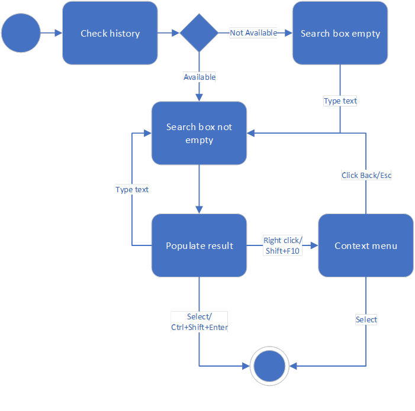

## 3.2 Mockups

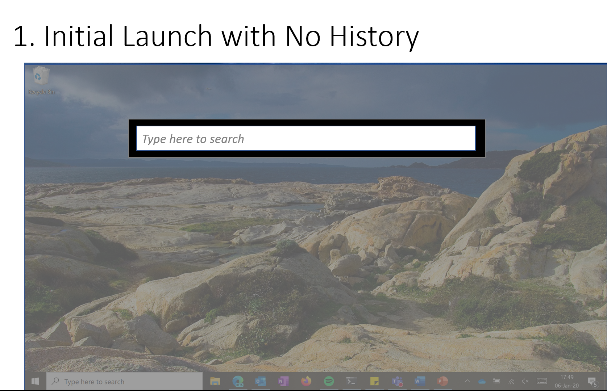

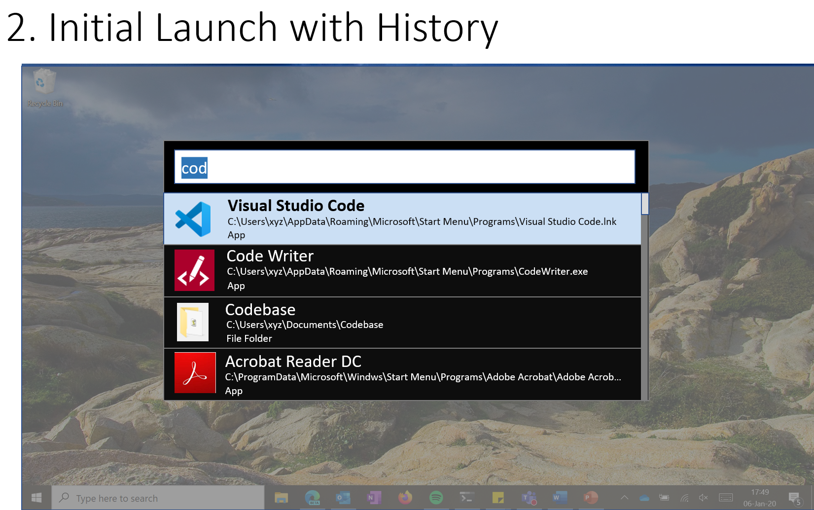

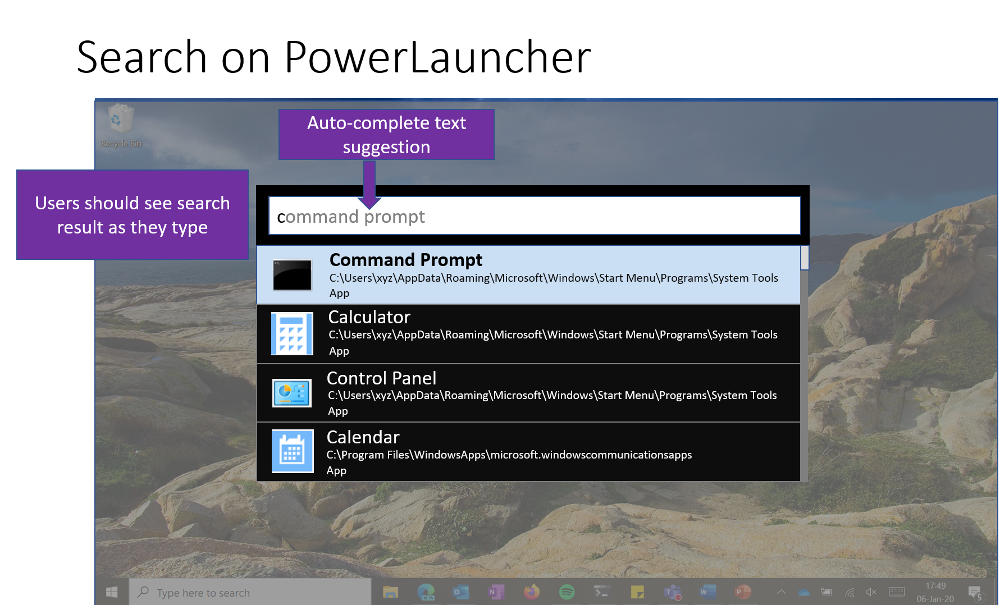

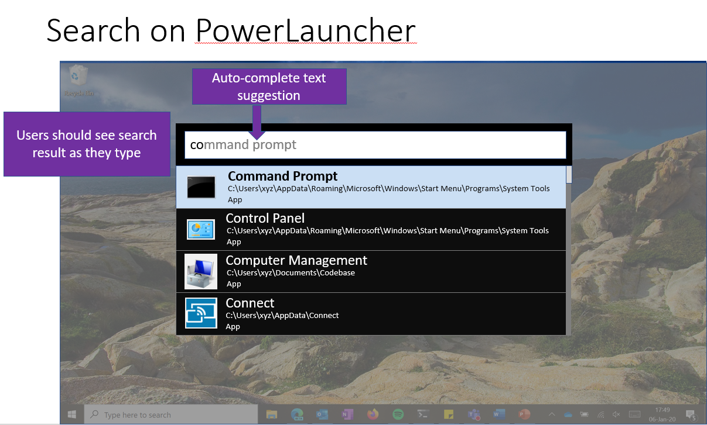

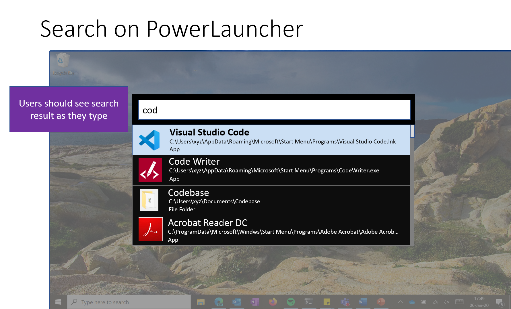

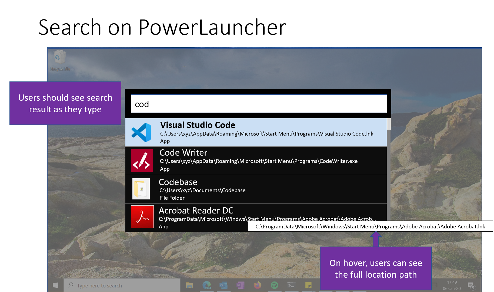

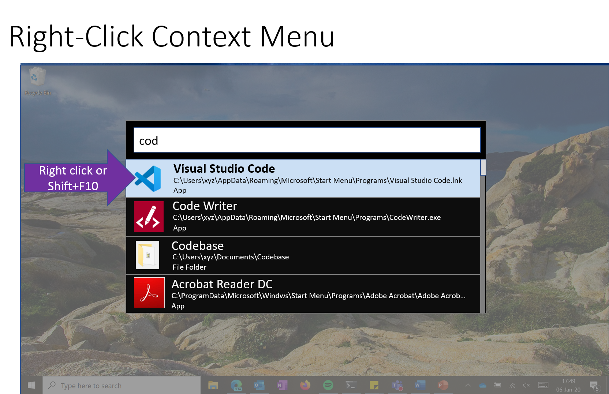

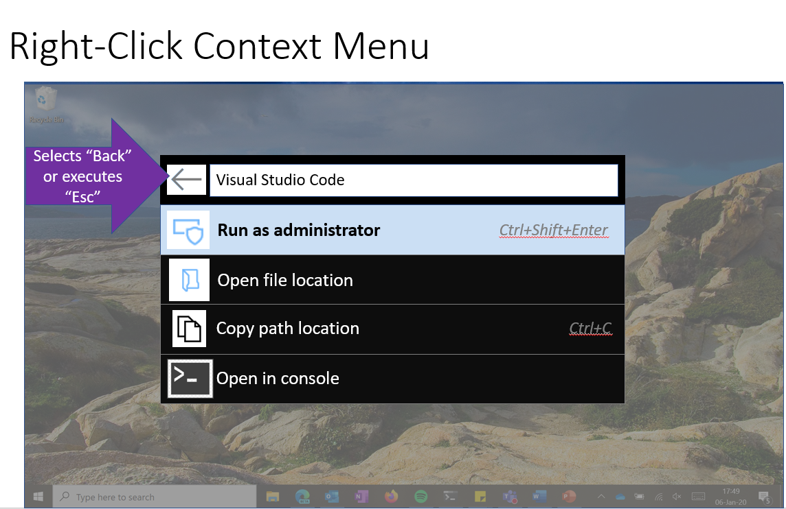

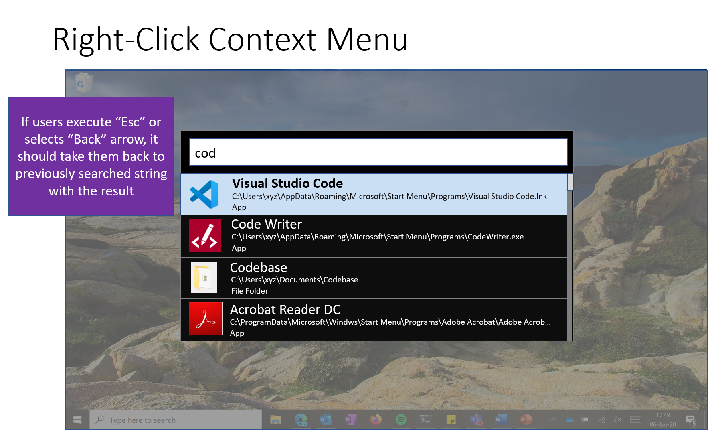

There are 2 behaviour options for Tab:

1.  Use Tab to auto-complete a word. For example, if the auto-complete
    text suggestion is for “Command Prompt”, pressing Tab after typing
    “co” will only complete the word “Command”.

2.  Use Tab to go to the next option which is similar behavior as to how
    Command Prompt works.

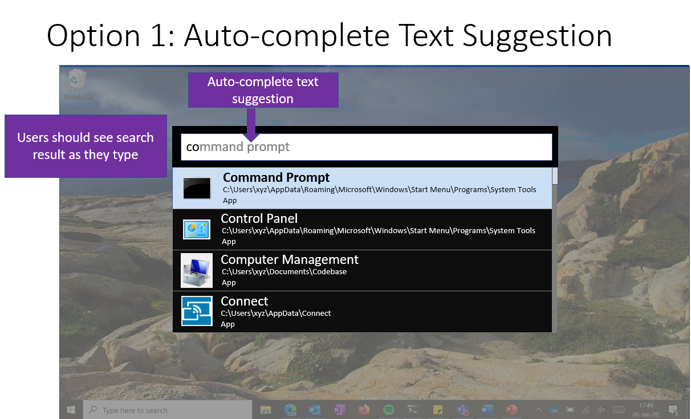

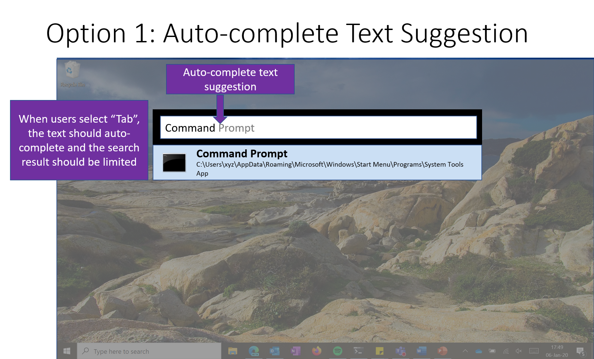

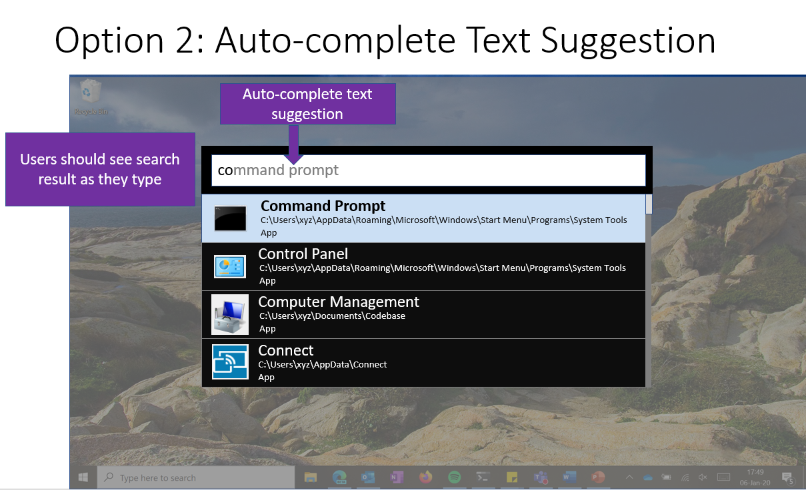

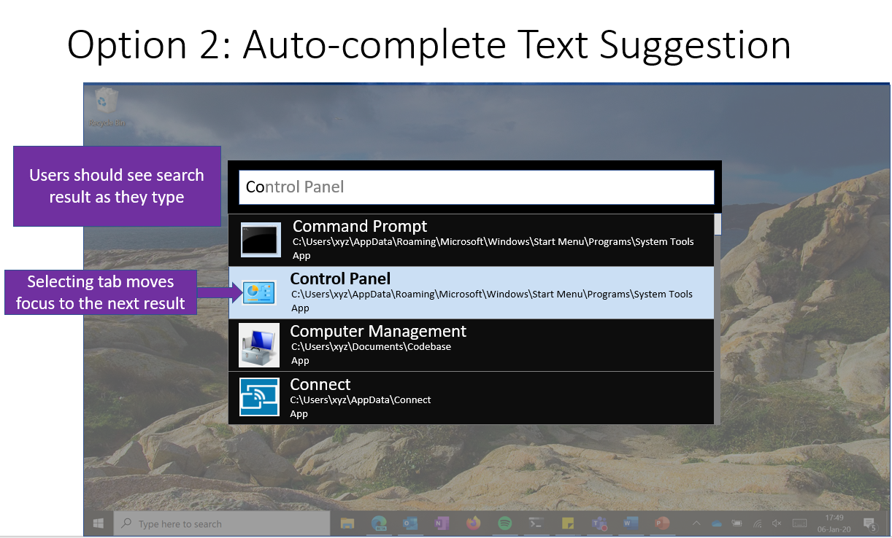

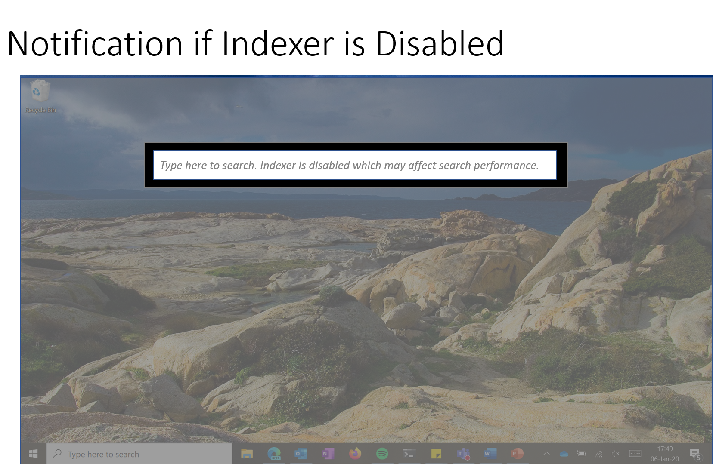

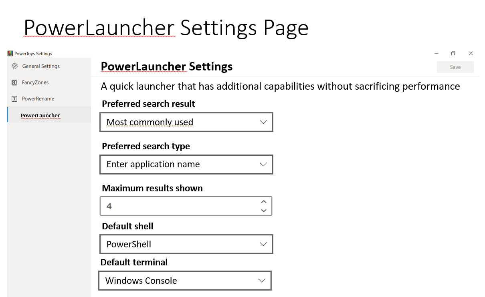

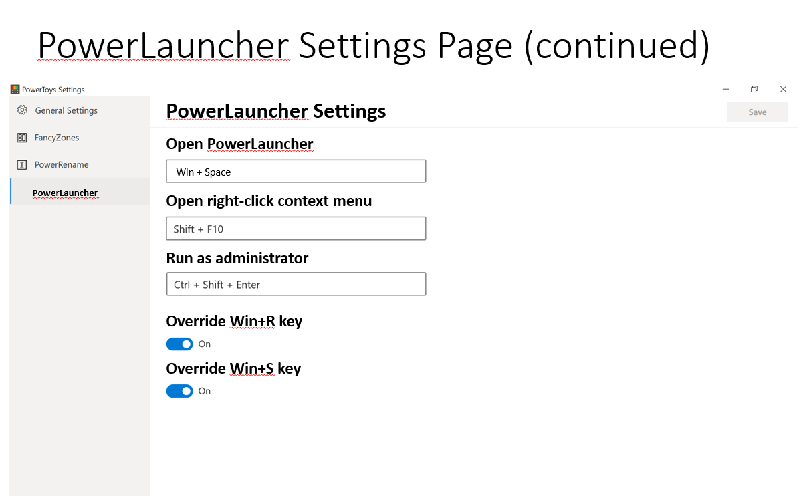

# 4\. Dependencies

  - [WindowWalker](https://github.com/betsegaw/windowwalker)
    
      - PowerLauncher is planning to integrate with WindowWalker to add
        capability for searching running applications/processes

  - [WoX](http://www.wox.one/)
    
      - We may collaborate with WoX

  - Keyboard Shortcut Manager PowerToy
    
      - PowerLauncher has functionality to modify keyboard shortcuts.
        This UI should eventually be integrated with keyboard shortcut
        manager toy to provide a coherent shortcut manager across all
        toys.

  - [Ability to set a default
    console](https://nam06.safelinks.protection.outlook.com/?url=https%3A%2F%2Fgithub.com%2Fmicrosoft%2Fterminal%2Fissues%2F492&data=02%7C01%7CJessica.Yuwono%40microsoft.com%7C9747fbabea5344fbe76308d78d70b745%7C72f988bf86f141af91ab2d7cd011db47%7C1%7C0%7C637133387606886938&sdata=i3iHTjw8z5x1Dpu40PQ6feylOXM%2F3jmG9atV%2F%2F1QAlU%3D&reserved=0)
    
      - Currently, there is no way to set the conhost.exe in order to
        set a console as default

# 5\. Supporting Documents

1.  [Difference between a console, a shell, and a
    terminal](https://www.hanselman.com/blog/WhatsTheDifferenceBetweenAConsoleATerminalAndAShell.aspx)

2.  [Search indexing in
    Windows 10](https://support.microsoft.com/en-us/help/4098843/windows-10-search-indexing-faq)
